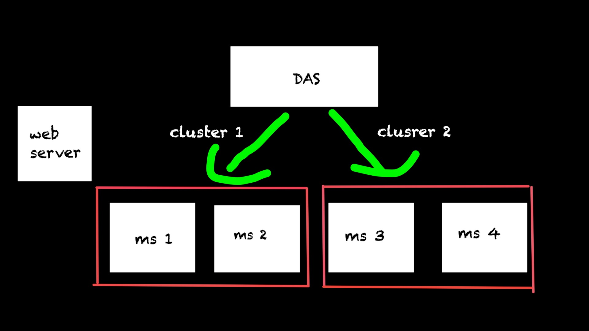
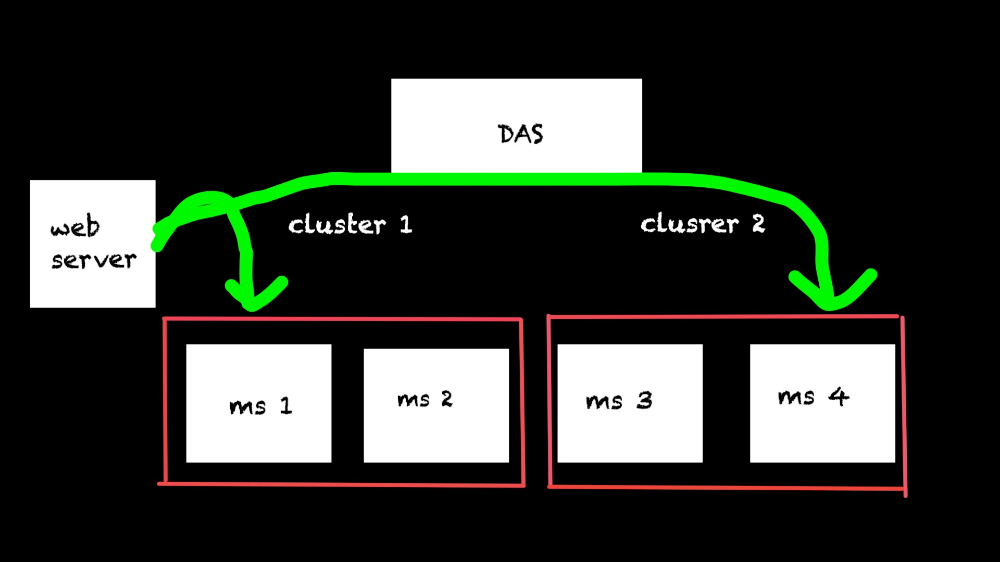

### Linux에 web과 was 연동 

ubuntu에 APACHE(WEB)과 TOMCAT(WAS)를 연동할 것입니다. 

우선 가상머신 위에 ubuntu iso를 이용해 서버를 설치합니다. 그러면 한 os 내에서 여러개의 os를 사용할 수 있게 됩니다. ubuntu는 linux의 일종입니다. gui환경도 제공해주며 서버이며 가장 널리 쓰입니다. 

### 1) web과 was의 개념 

web은 웹페이지의 줄임말로 다른 인터넷 상의 문서와 서로 연결할 수 있게 해주는 강조된(highlighted) 글자나 그림 등이 있다는 것이 특징입니다. 

was는 web application server의 약자로 web에서 온 요청을 받아주는 역할을 합니다. was를 여러개 두어 web server로부터 명령을 분산시킬 수 있고, 트래픽을 유동적으로 처리할 수 있게 도와줍니다.  

apache는 web server의 한 종류입니다. http protocol로 통신하며 80포트를 사용합니다.  

tomcat은 was(web application server)의 한 종류입니다. 저희가 만든 war file을 deploy하고 관리할 수 있도록 gui환경들을 제공해줍니다. 

 
                                                     
                                                     
## ubuntu에 web과 was 연동하기 영상                                                   
                                                     

<iframe width="651" height="366" src="https://www.youtube.com/embed/VrJsIHXNq5o" title="YouTube video player" frameborder="0" allow="accelerometer; autoplay; clipboard-write; encrypted-media; gyroscope; picture-in-picture" allowfullscreen></iframe>

### 2) weblogic 

 

DOMAIN은 DAS와 MS들을 모아놓은 하나의 단위를 의미합니다. DAS로부터 MS들은 세팅을 받아 ready 상태가 되고 web server로부터의 명령을 처리합니다. 같은 명령어를 처리하는 MS끼리 묶인 것을 CLUSETER

라고 일컫습니다. 

 

web server로부터 명령을 받아 was로 전달하게 됩니다. 

## web logic을 이용해 was를 관리하는 영상입니다.

<iframe width="651" height="366" src="https://www.youtube.com/embed/URzTJj--QsM" title="YouTube video player" frameborder="0" allow="accelerometer; autoplay; clipboard-write; encrypted-media; gyroscope; picture-in-picture" allowfullscreen></iframe>

### 3) google cloud 

IaaS는 인터넷을 통해 서버와 스토리지 등 데이터센터 자원을 빌려 쓸 수 있는 서비스를 말합니다. 

SaaS는 클라우드 환경에서 운영되는 애플리케이션 서비스입니다.

PaaS는 소프트웨어 서비스를 개발할 때 필요한 플랫폼을 제공하는 서비스입니다.

클라우드는 IaaS -> SaaS -> PaaS 순으로 발전이 되어 왔습니다.

구글 클라우드 네이버 클라우드 모두 SaaS에 속하게 됩니다 

## google cloud를 이용해 web과 was를 설치해 서로 연동하는 영상입니다 

<iframe width="651" height="366" src="https://www.youtube.com/embed/VMMAVo4nr30" title="YouTube video player" frameborder="0" allow="accelerometer; autoplay; clipboard-write; encrypted-media; gyroscope; picture-in-picture" allowfullscreen></iframe>

